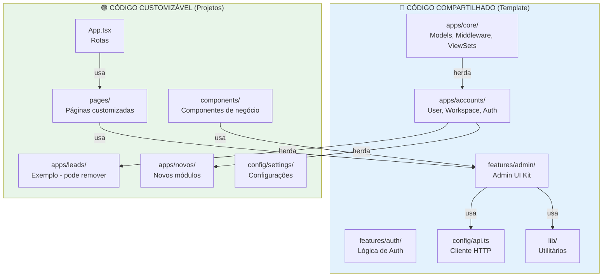

# Código Compartilhado vs Customizável — Guia para LLMs

> **Versão**: 1.0.0
> **Última atualização**: 2024-12
> **Propósito**: Definir claramente o que é código compartilhado (do template) vs código customizável (em projetos derivados)

---

## 🎯 Propósito deste Documento

Este repositório é um **template GitHub** que serve como base para criar novos projetos SaaS. Este documento define:

- ✅ **Código Compartilhado**: Código que vem do template e deve ser sincronizado quando o template é atualizado
- 🔧 **Código Customizável**: Código que projetos derivados podem e devem modificar livremente

**Regra de Ouro para LLMs**: Antes de modificar qualquer arquivo, verifique se ele está na lista de compartilhados. Se estiver, **NUNCA modifique diretamente** — use herança/extensão.

---

## 📊 Diagrama de Dependências



---

## 🔵 Backend — Código Compartilhado

### `apps/core/` — 100% Compartilhado

**⚠️ CRÍTICO: NUNCA modificar diretamente. Este é o núcleo do sistema.**

| Arquivo | Descrição | Por que é compartilhado |
|---------|-----------|------------------------|
| `models.py` | `WorkspaceModel`, `BaseModel`, `UUIDPrimaryKeyMixin` | Base estrutural de todos os models |
| `middleware.py` | `WorkspaceMiddleware`, `UUIDSessionMiddleware` | Multi-tenancy crítico |
| `viewsets.py` | `WorkspaceViewSet`, `BaseViewSet` | Base para todos os ViewSets |
| `permissions.py` | `WorkspaceObjectPermission` | Segurança (prevenção IDOR) |
| `audit.py` | Sistema de auditoria LGPD | Compliance obrigatório |
| `cache.py` | Estratégias de cache | Performance e isolamento |
| `logging.py` | Logging estruturado | Observabilidade |
| `throttles.py` | Rate limiting | Proteção de APIs |
| `managers.py` | `SoftDeleteManager` | Soft delete automático |
| `serializers.py` | Serializers base | Base para serialização |

**Regras para LLMs:**
- ❌ **NUNCA** modificar arquivos em `apps/core/` diretamente
- ✅ Se precisar customizar, use **herança** ou **extensão**
- ✅ Documente extensões claramente
- ✅ Teste extensões com cuidado

**Exemplo de Extensão (✅ Correto):**
```python
# ❌ ERRADO: Modificar apps/core/viewsets.py
# ✅ CORRETO: Criar extensão em seu app

# apps/meuapp/viewsets.py
from apps.core.viewsets import WorkspaceViewSet

class MeuViewSetCustomizado(WorkspaceViewSet):
    """ViewSet customizado que estende WorkspaceViewSet."""

    def get_queryset(self):
        # Customização aqui
        queryset = super().get_queryset()
        return queryset.filter(status='ativo')
```

---

### `apps/accounts/` — Parcialmente Compartilhado

**⚠️ ATENÇÃO: Base de autenticação, mas pode ser estendido.**

| Arquivo | Status | Regras |
|---------|--------|--------|
| `models.py` | Base compartilhada | `User`, `Workspace` são base — **NUNCA modificar diretamente**. Pode adicionar campos via herança. |
| `serializers.py` | Base compartilhada | Serializers base — pode ser estendido, não modificado. |
| `services.py` | Base compartilhada | Lógica de auth base — pode ser estendida. |
| `views.py` | Base compartilhada | Views de auth — pode ser estendida. |
| `urls.py` | Customizável | Pode adicionar rotas customizadas. |
| `admin.py` | Customizável | Pode customizar admin. |

**Regras para LLMs:**
- ❌ **NUNCA** modificar `User` ou `Workspace` diretamente
- ✅ Use **herança** ou **OneToOneField** para adicionar campos
- ✅ Estenda serializers/services, não modifique
- ✅ Documente extensões

**Exemplo de Extensão (✅ Correto):**
```python
# ❌ ERRADO: Modificar apps/accounts/models.py
# ✅ CORRETO: Criar perfil estendido

# apps/meuapp/models.py
from apps.accounts.models import User

class UserProfile(models.Model):
    """Perfil estendido do usuário."""
    user = models.OneToOneField(User, on_delete=models.CASCADE)
    bio = models.TextField()
    avatar = models.ImageField()
```

---

## 🟢 Backend — Código Customizável

### `apps/leads/` — Exemplo (Pode ser Removido)

**✅ Totalmente customizável ou pode ser removido completamente.**

Este módulo serve como **exemplo** de como usar o core. Projetos derivados podem:
- Remover completamente
- Modificar livremente
- Usar como referência para criar novos módulos

---

### Novos Apps — Totalmente Customizáveis

**✅ Projetos podem criar novos apps seguindo os padrões do core.**

```
apps/
├── core/          # 🔵 Compartilhado (NUNCA modificar)
├── accounts/      # 🔵 Parcialmente compartilhado (estender, não modificar)
├── leads/         # 🟢 Customizável (exemplo, pode remover)
└── meuapp/        # 🟢 Customizável (novo app do projeto)
```

**Regras para LLMs:**
- ✅ Pode criar novos apps livremente
- ✅ Deve herdar de `WorkspaceModel` para multi-tenancy
- ✅ Deve usar `WorkspaceViewSet` como base
- ✅ Seguir convenções do projeto

---

### `config/settings/` — Customizável com Cuidado

| Arquivo | Status | Regras |
|---------|--------|--------|
| `base.py` | ⚠️ Cuidado | Settings base — pode ter extensões, mas mudanças afetam tudo |
| `dev.py` | ✅ Customizável | Settings de desenvolvimento — totalmente customizável |
| `prod.py` | ✅ Customizável | Settings de produção — totalmente customizável |
| `urls.py` | ✅ Customizável | Roteamento — pode adicionar rotas livremente |

**Regras para LLMs:**
- ✅ Pode modificar `dev.py` e `prod.py` livremente
- ⚠️ Cuidado ao modificar `base.py` — afeta todo o sistema
- ✅ Pode adicionar rotas em `urls.py`
- ✅ Use variáveis de ambiente para configurações

---

## 🔵 Frontend — Código Compartilhado

### `features/admin/` — Admin UI Kit (100% Compartilhado)

**⚠️ CRÍTICO: NUNCA modificar diretamente. Este é o Admin UI Kit completo.**

| Pasta/Arquivo | Descrição | Por que é compartilhado |
|---------------|-----------|------------------------|
| `components/layout/` | `MainLayout`, `Sidebar`, `Header`, `Breadcrumbs`, `TenantSelector` | Layout base do admin |
| `components/resources/` | `ResourceListPage`, `ResourceFormPage` | Sistema genérico de recursos |
| `components/data-display/` | `DataTable`, `SearchBar`, `Pagination`, `BulkActions`, `EmptyState`, `LoadingState` | Componentes de exibição de dados |
| `components/forms/` | `FormField`, `SubmitButton` | Componentes de formulário genéricos |
| `hooks/` | `useResource`, `useTable`, `usePagination`, `usePermissions`, `useTenant` | Hooks reutilizáveis |
| `pages/` | `DashboardPage`, `SettingsPage` | Páginas base do admin |

**Regras para LLMs:**
- ❌ **NUNCA** modificar componentes em `features/admin/` diretamente
- ✅ Se precisar customizar, crie **wrappers** ou **componentes compostos**
- ✅ Mantenha compatibilidade com a API do Admin UI Kit
- ✅ Documente customizações

**Exemplo de Customização (✅ Correto):**
```typescript
// ❌ ERRADO: Modificar features/admin/components/layout/Sidebar.tsx
// ✅ CORRETO: Criar wrapper customizado

// components/CustomSidebar.tsx
import { Sidebar } from "@/features/admin/components/layout/Sidebar";

export function CustomSidebar() {
  return (
    <Sidebar>
      {/* Customizações aqui */}
      <CustomMenuItem />
    </Sidebar>
  );
}
```

---

### `features/auth/` — Parcialmente Compartilhado

**⚠️ ATENÇÃO: Lógica compartilhada, UI pode ser customizada.**

| Pasta/Arquivo | Status | Regras |
|---------------|--------|--------|
| `services/socialAuth.ts` | 🔵 Compartilhado | Lógica de OAuth — não modificar |
| `hooks/useSocialProviders.ts` | 🔵 Compartilhado | Hook de providers — não modificar |
| `components/login-form.tsx` | 🟢 Customizável | UI pode ser customizada |
| `components/register-form.tsx` | 🟢 Customizável | UI pode ser customizada |
| `pages/Login.tsx` | 🟢 Customizável | Página pode ser customizada |
| `pages/Register.tsx` | 🟢 Customizável | Página pode ser customizada |

**Regras para LLMs:**
- ❌ **NUNCA** modificar lógica de autenticação (`services/`, `hooks/`)
- ✅ Pode customizar UI completamente (`components/`, `pages/`)
- ✅ Mantenha integração com `AuthContext`

---

### `config/api.ts` — Cliente HTTP (Compartilhado)

**⚠️ Base do cliente HTTP — NUNCA modificar diretamente.**

Este arquivo contém:
- Configuração do cliente Axios
- Interceptadores (tenant, JWT, CSRF)
- Tratamento de erros (401, 403)

**Regras para LLMs:**
- ❌ **NUNCA** modificar `config/api.ts` diretamente
- ✅ Se precisar customizar, crie um wrapper ou estenda o cliente
- ✅ Mantenha compatibilidade com interceptadores existentes

---

### `lib/` — Utilitários (Compartilhado)

| Arquivo | Descrição | Status |
|---------|-----------|--------|
| `utils.ts` | `cn()` e utilitários gerais | 🔵 Compartilhado |
| `admin/resource-config.ts` | Sistema de configuração de recursos | 🔵 Compartilhado |
| `admin/formatters.ts` | Formatadores (data, etc) | 🔵 Compartilhado |

**Regras para LLMs:**
- ❌ **NUNCA** modificar utilitários compartilhados diretamente
- ✅ Pode adicionar novos utilitários em `lib/` (não modificar existentes)

---

## 🟢 Frontend — Código Customizável

### `features/leads/` — Exemplo (Pode ser Removido)

**✅ Totalmente customizável ou pode ser removido completamente.**

Este módulo serve como **exemplo** de como usar o Admin UI Kit. Projetos derivados podem:
- Remover completamente
- Modificar livremente
- Usar como referência para criar novos módulos

---

### `pages/` — Totalmente Customizável

**✅ Projetos customizam completamente suas páginas.**

| Arquivo | Status | Regras |
|---------|--------|--------|
| `Home.tsx` | 🟢 Customizável | Home page — projetos customizam completamente |
| `Dashboard.tsx` | 🟢 Customizável | Dashboard — pode usar `DashboardPage` do admin ou criar próprio |

**Regras para LLMs:**
- ✅ Pode modificar livremente
- ✅ Pode criar novas páginas
- ✅ Seguir convenções de roteamento

---

### `App.tsx` — Rotas e Estrutura (Customizável)

**✅ Projetos adicionam suas próprias rotas.**

**Regras para LLMs:**
- ✅ Pode adicionar rotas livremente
- ✅ Pode modificar estrutura de roteamento
- ✅ Manter rotas protegidas com `ProtectedRoute`

---

### `components/` (Exceto Admin) — Customizável

**✅ Componentes de negócio são totalmente customizáveis.**

**Regras para LLMs:**
- ✅ Pode criar componentes livremente
- ✅ Pode usar componentes do Admin UI Kit como base
- ✅ Seguir padrões de design do projeto

---

## 📋 Regras para LLMs

### Ao Trabalhar com Código Compartilhado

**Checklist obrigatório:**

1. ✅ **Verificar** se o arquivo está na lista de compartilhados acima
2. ❌ **NUNCA** modificar código compartilhado diretamente
3. ✅ Se precisar customizar, usar **herança**, **extensão** ou **wrappers**
4. ✅ **Documentar** extensões claramente
5. ✅ **Testar** extensões com cuidado
6. ✅ **Manter** compatibilidade com código compartilhado

**Exemplo de Processo:**
```
1. Identificar necessidade de customização
2. Verificar se código é compartilhado
3. Se for compartilhado:
   - Criar extensão/wrapper
   - Documentar extensão
   - Testar extensão
4. Se não for compartilhado:
   - Modificar livremente
```

---

### Ao Trabalhar com Código Customizável

**Checklist:**

1. ✅ Pode modificar livremente
2. ✅ Seguir convenções do projeto
3. ✅ Manter compatibilidade com código compartilhado
4. ✅ Documentar mudanças significativas
5. ✅ Testar mudanças

---

### Ao Trabalhar com Funcionalidades Críticas

**Checklist obrigatório:**

1. ✅ **Verificar** se funcionalidade tem contrato em `docs/contracts/`
2. ✅ **Ler contrato completo** antes de implementar
3. ✅ **Seguir estrutura definida** no contrato (models, helpers, convenções)
4. ✅ **Manter compatibilidade** com bootstrap (herdar `WorkspaceModel`, usar `WorkspaceViewSet`)
5. ✅ **Documentar extensões** se customizar além do contrato

**Contratos disponíveis:**
- `MODULE_ACTIVATION.md` - Para módulos ativáveis por workspace
- `DYNAMIC_FORMS.md` - Para formulários dinâmicos criados em runtime

**Referência:** `@docs/contracts/README.md`

---

### Ao Sincronizar do Template

**Processo de Sincronização (Manual):**

1. ✅ **Verificar versão** do template (tags Git: `v1.0.0`, `v1.1.0`, etc)
2. ✅ **Revisar CHANGELOG** do template para breaking changes
3. ✅ **Identificar mudanças** no template:
   ```bash
   git remote add template https://github.com/seu-usuario/saas-bootstrap.git
   git fetch template
   git diff main template/main -- shared/
   ```
4. ✅ **Aplicar mudanças seletivamente**:
   ```bash
   # Aplicar mudanças de arquivo específico
   git checkout template/main -- backend/apps/core/models.py
   ```
5. ✅ **Resolver conflitos** manualmente (se houver)
6. ✅ **Testar** após sincronização:
   ```bash
   ./run-tests.sh
   ```
7. ✅ **Commit** com mensagem clara:
   ```bash
   git commit -m "chore: sync shared code from template v1.2.0"
   ```

**Checklist de Validação:**
- [ ] Todas as mudanças foram revisadas
- [ ] Conflitos foram resolvidos
- [ ] Testes passam
- [ ] Código customizado ainda funciona
- [ ] Documentação atualizada (se necessário)

---

## 🔄 Processo de Sincronização Detalhado

### Identificando Mudanças no Template

```bash
# 1. Adicionar remote do template (se não existir)
git remote add template https://github.com/seu-usuario/saas-bootstrap.git

# 2. Buscar mudanças
git fetch template

# 3. Ver diferenças em código compartilhado
git diff main template/main -- backend/apps/core/
git diff main template/main -- frontend/src/features/admin/

# 4. Ver resumo de arquivos modificados
git diff --name-only main template/main
```

### Aplicando Mudanças Seletivamente

```bash
# Aplicar mudanças de arquivo específico
git checkout template/main -- backend/apps/core/models.py

# Aplicar mudanças de pasta específica
git checkout template/main -- backend/apps/core/

# Ver mudanças antes de aplicar
git diff --staged
```

### Resolvendo Conflitos

Se houver conflitos ao sincronizar:

1. **Identificar** arquivos com conflitos
2. **Revisar** mudanças do template vs. customizações locais
3. **Decidir** se customizações locais devem ser mantidas
4. **Aplicar** mudanças do template manualmente (se necessário)
5. **Testar** após resolver conflitos

---

## 💡 Exemplos Práticos

### Exemplo 1: Estender WorkspaceModel (✅ Correto)

```python
# ❌ ERRADO: Modificar apps/core/models.py
# ✅ CORRETO: Criar model que herda WorkspaceModel

# apps/meuapp/models.py
from apps.core.models import WorkspaceModel

class MeuModel(WorkspaceModel):
    """Model customizado que herda WorkspaceModel."""
    nome = models.CharField(max_length=255)
    descricao = models.TextField()

    class Meta:
        db_table = 'meuapp_meumodel'
```

---

### Exemplo 2: Customizar Admin UI Kit (✅ Correto)

```typescript
// ❌ ERRADO: Modificar features/admin/components/layout/Sidebar.tsx
// ✅ CORRETO: Criar wrapper customizado

// components/CustomSidebar.tsx
import { Sidebar } from "@/features/admin/components/layout/Sidebar";
import { MenuItem } from "./MenuItem";

export function CustomSidebar() {
  return (
    <Sidebar>
      <MenuItem to="/dashboard" icon="home">Dashboard</MenuItem>
      <MenuItem to="/custom" icon="star">Custom Page</MenuItem>
    </Sidebar>
  );
}
```

---

### Exemplo 3: Criar Novo Módulo Customizável

```python
# apps/meuapp/models.py
from apps.core.models import WorkspaceModel

class MeuModel(WorkspaceModel):
    """Novo model customizado."""
    nome = models.CharField(max_length=255)

# apps/meuapp/serializers.py
from apps.core.serializers import WorkspaceSerializer
from .models import MeuModel

class MeuModelSerializer(WorkspaceSerializer):
    class Meta:
        model = MeuModel
        fields = ['id', 'nome', 'created_at']

# apps/meuapp/viewsets.py
from apps.core.viewsets import WorkspaceViewSet
from .models import MeuModel
from .serializers import MeuModelSerializer

class MeuModelViewSet(WorkspaceViewSet):
    queryset = MeuModel.objects.all()
    serializer_class = MeuModelSerializer
```

---

## 📚 Referências Cruzadas

- [`@docs/context/PROTECTED_AREAS.md`](docs/context/PROTECTED_AREAS.md) — Zonas de proteção
- [`@docs/ARCHITECTURE.md`](docs/ARCHITECTURE.md) — Decisões arquiteturais
- [`@docs/TEMPLATE_SETUP.md`](docs/TEMPLATE_SETUP.md) — Setup do template
- [`@CLAUDE.md`](../CLAUDE.md) — Contexto global
- [`@backend/ANALYSIS.md`](../backend/ANALYSIS.md) — Análise do backend
- [`@frontend/README.md`](../frontend/README.md) — Análise do frontend

---

## ⚠️ Lembrete Final para LLMs

> **Antes de modificar qualquer arquivo, pergunte-se:**
>
> 1. Este arquivo está na lista de compartilhados?
> 2. Se sim, preciso usar herança/extensão ao invés de modificar?
> 3. Documentei minha extensão?
> 4. Testei minha extensão?
>
> **Quando em dúvida, consulte este documento primeiro.**

---

**Última atualização**: 2024-12
**Versão do Template**: 1.0.0


